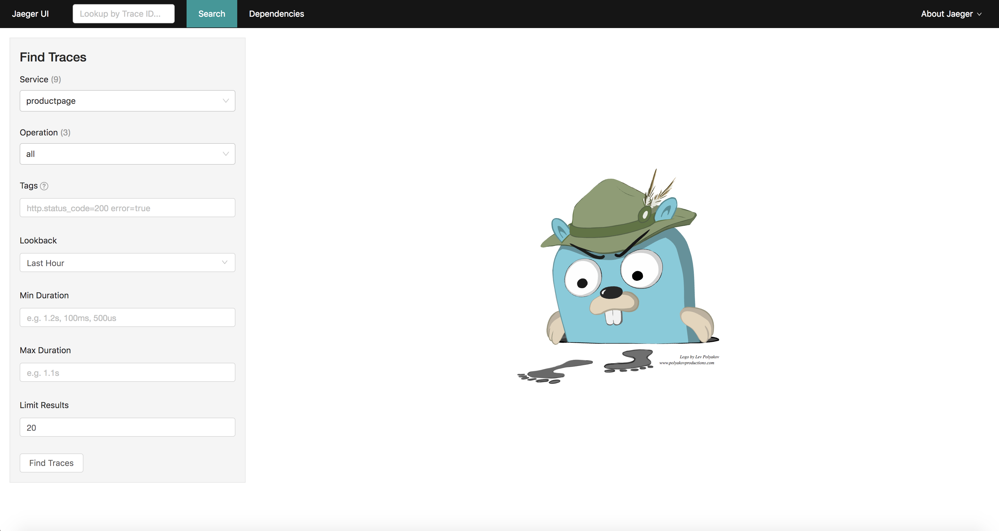

# lab 2 - Deploy Istio

Now that we have the kubernetes cluster, we are ready to deploy Istio.

## Steps

* [1. Installing Istio](#1)
* [2. Seting up istioctl](#2)
* [3. Verify install](#3)
* [4. Installing Add-ons](#4)

## <a name="1"></a> 1 - Installing Istio


We have developed an Istio [Mixer Adapter](https://github.com/solarwinds/istio-adapter) which can ship metrics to [Appoptics](https://www.appoptics.com/) and logs to [Loggly](https://www.loggly.com/) and [Papertrail](https://papertrailapp.com). If you would like to leverage this adapter, please proceed to [Optional Lab 2](optional.md) to set things up, get the API tokens and [Installing Istio](#aolg) (OR) please proceed to [Installing Istio](#noaolg).

### <a name="aolg"></a>Installing istio with Appoptics and Loggy Tokens

```sh
kubectl apply -f mesh-appoptics-loggly.yaml
```

### <a name="noaolg"></a>Installing istio

```sh
kubectl apply -f mesh.yaml
```


## <a name="2"></a> 2 - Verify install

Istio is deployed in a separate Kubernetes namespace `istio-system`. To check if Istio is deployed and also to see all the pieces that are deployed, we can do the following:

```sh
watch kubectl get all -n istio-system
```


## <a name="3"></a> 3 - Setting up istioctl
On a *nix system, you can setup istioctl by doing the following: 

```sh
curl -L https://git.io/getLatestIstio | sh -
```

Assuming you are in the `/root` directory, adding istio executables to the PATH can be done by doing the following:
```sh
export PATH="$PATH:/root/istio-0.8.0/bin"
```

To verify `istioctl` is setup lets try to print out the command help
```sh
istioctl -h
```


####  Install Add-ons
For the folks who did NOT want to use Appoptics, you can deploy prometheus and grafana for viewing the metrics from `Istio`.

For distributed tracing, you can choose between [Zipkin](https://zipkin.io/) or [Jaeger](https://www.jaegertracing.io/).

On Istio 0.8.0, Jaeger is deployed as part of `istio-demo.yaml` or `istio-demo-auth.yaml`.

#####Grafana, Prometheus
On Istio 0.7.1, you can deploy prometheus by running the following command:

```sh
kubectl apply -f install/kubernetes/addons/prometheus.yaml
```

On Istio 0.8.0, prometheus is deployed as part of `istio-demo.yaml` or `istio-demo-auth.yaml`.


To deploy grafana:
```sh
kubectl apply -f install/kubernetes/addons/grafana.yaml
```

By default prometheus and grafana services are deployed as ClusterIP type. We can access the services outside by either changing the type to LoadBalancer or NodePort or configure Istio Ingress. 

To expose them using NodePort service type, we can edit the services and change the service type from `ClusterIP` to `NodePort`

```sh
kubectl -n istio-system edit svc prometheus
```

```sh
kubectl -n istio-system edit svc grafana
```

Once this is done the services will be assigned dedicated ports on the hosts. In `PWK`, once a port is exposed it will appear on top of the page as shown below as clickable hyperlinks:


We can click on the new links now and navigate to prometheus dashboard and grafana dashboards. In grafana there is a dedicated dashboard created for Istio called `Istio Dashboard`.


##### <a name="zipkin"></a>Zipkin
On Istio 0.7.1, we can deploy Zipkin by:

```sh
kubectl apply -f install/kubernetes/addons/zipkin.yaml
```

You can follow similar steps as described above to expose this service as well.

##### <a name="jaeger"></a> Jaeger
On Istio 0.7.1, we can deploy Jaeger by:

```sh
kubectl apply -n istio-system -f https://raw.githubusercontent.com/jaegertracing/jaeger-kubernetes/master/all-in-one/jaeger-all-in-one-template.yml
```

You can follow similar steps as described above to expose this service as well.

One Istio 0.8.0, Jaeger port is already exposed for you as part of `istio-demo.yaml` or `istio-demo-auth.yaml`.




#### [Continue to lab 3 - Deploy Sample Bookinfo app](../lab-3/README.md)