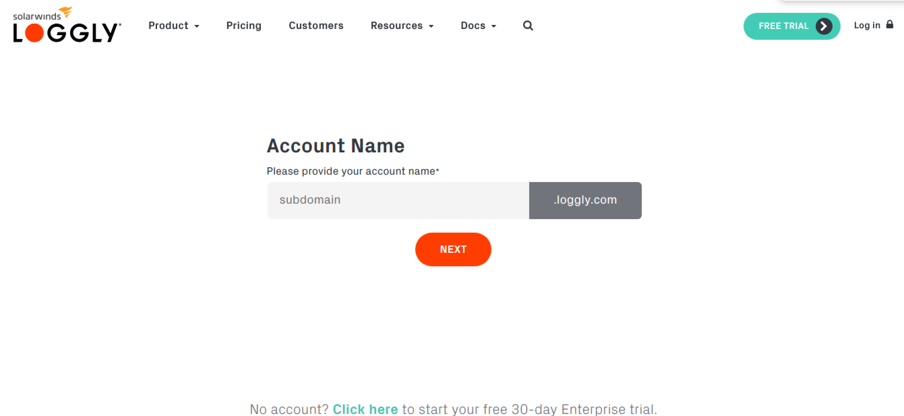
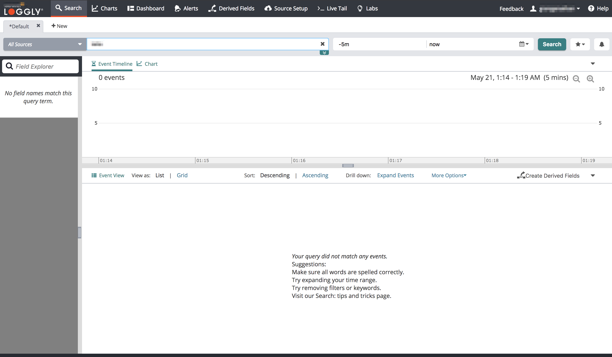
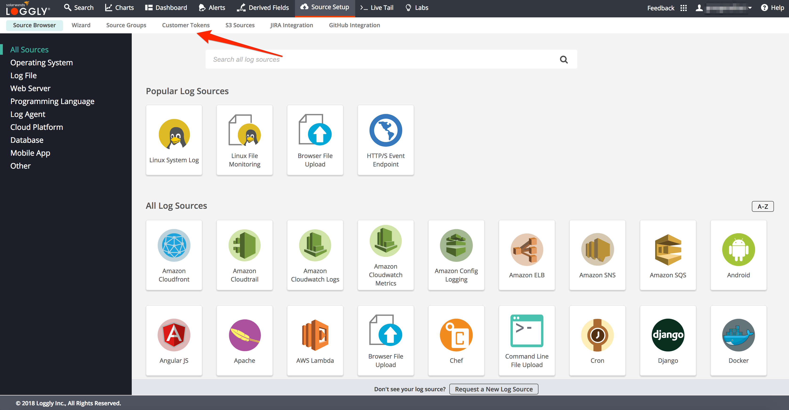
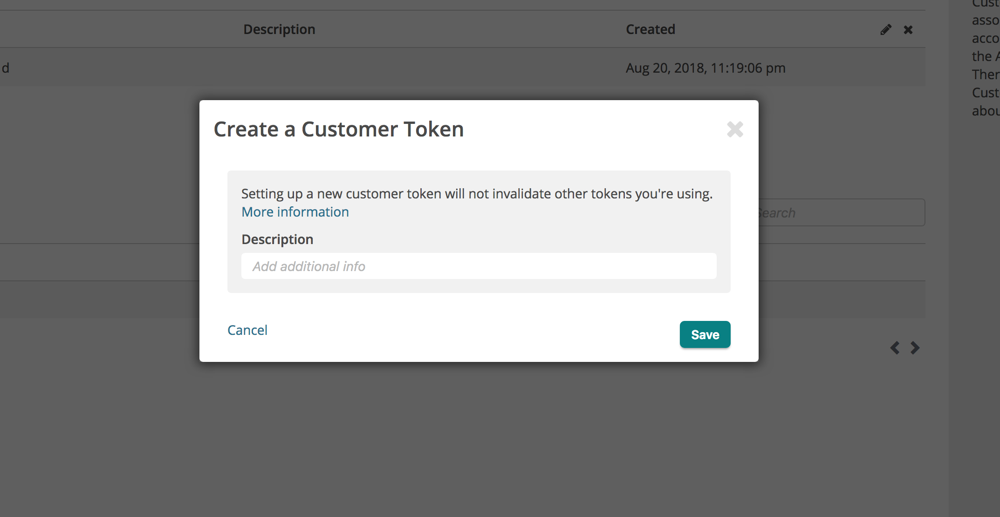
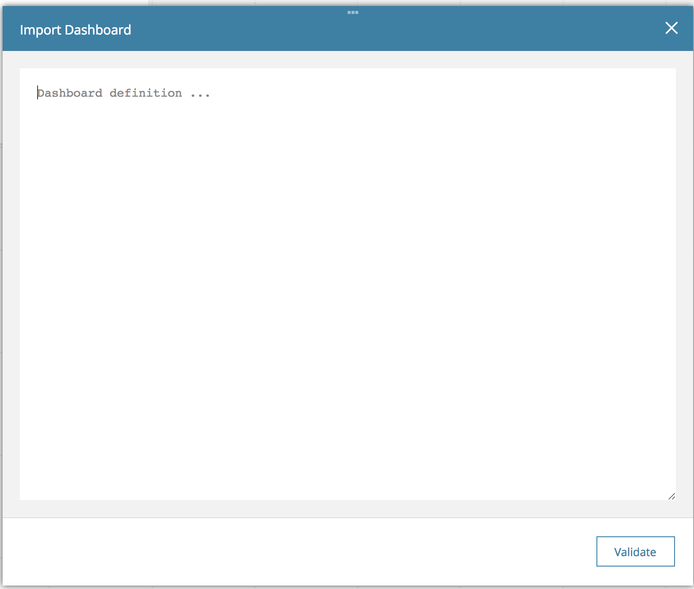

# Optional Lab 2 - Setting up API Tokens (optional)

As part of this workshop we will be sending access logs from Istio to [Loggly](https://www.loggly.com/) and telemetry data to [Appoptics](https://www.appoptics.com/). In this lab we will take you through the steps needed to setup Loggly & Appoptics API tokens and configure Appoptics dashboard.

## Steps

* [1. Set up loggly API Token](#1)
* [2. Setup Appoptics API Token](#2)
* [3. Setup Appoptics Dashboard](#3)

## <a name="1"></a> 1 - Set up Loggly API Token


Getting a Loggly API token for use with istio:

[Loggly](https://www.loggly.com/)


To signup for [Loggly signup](https://www.loggly.com/signup/)


[Loggin sign in](https://www.loggly.com/login/)


After login you will be taken to the Loggly landing page. From here, select `Source Setup` from the top menu: 

On the `Source Setup` page select the `Customer Tokens` item from the sub-menu



On the `Customer Tokens` page let us create a new Token by using the `Add New` button.


This open a popup confirming the creation of a new token.


Please enter a good description for you to identify the token.

Once the token is created you will be able to see it in the Tokens table. On the left there is a `copy to clipboard` button which can help with copying the new token.


We can now store this token in an environment variable for later use:
```sh
LOGGLY_TOKEN="PASTE YOUR TOKEN HERE"
```


## <a name="2"></a> 2 - Setup Appoptics API Token
Reserve your lab account [here](https://docs.google.com/spreadsheets/d/174haSpPTlDZeZLJTJRUeHZydgxpnTQScthtLLWMj3mc/edit?usp=sharing).

Using your reserved token is token in an environment variable for later use:
```sh
AOTOKEN="PASTE YOUR TOKEN HERE"
```

## <a name="3"></a> 3 - Setup Appoptics Dashboard

Now from the left menu select `Dashboard & Metrics`.


It will take you to a Dashboards page


Once you are in the `Dashboards` screen you can create a new dashboard by using `Create a New Dashboard` button. It will take you right to a new dashboard.


You can now give your dashboard a temporary name. Next click on the button shown in the previous image. It will open up a menu with an option to import a dashboard.


Clicking the `Import Dashboard` menu item will open a popup where we can enter the contents of `https://raw.githubusercontent.com/leecalcote/istio-service-mesh-workshop/master/deployment_files/appoptics_dashboard.yaml` file


After pasting the contents, we can validate it by using the `Validate` button


Once validated, we can import the dashboard by using the `Import` button. You will be presented with a warning popup as shown here. Proceed by clicking `OK` here.


You will be taken to a pre-constructed dashboard.

