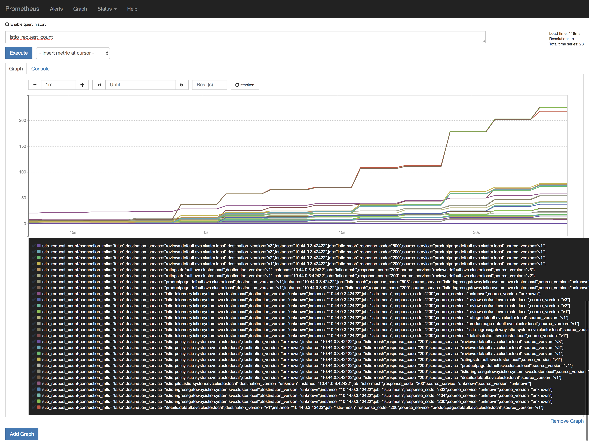

# Lab 5 - Telemetry

## 5.1 Generate Load on Bookinfo
Let's generate HTTP traffic against the BookInfo application, so we can see interesting telemetry. Grab the ingress gateway port number and store it in a variable:

```sh
export INGRESS_PORT=$(kubectl get service istio-ingressgateway -n istio-system --template='{{(index .spec.ports 1).nodePort}}')
```

Once we have the port, we can append the IP of one of the nodes to get the host.

```sh
export INGRESS_HOST="<IP>:$INGRESS_PORT"
```

Now, let us generate a small load on the sample app by using [Meshery](https://layer5.io/meshery), which service mesh management plane.

View the generated metrics.

### Exposing services
In this training, two methods may be used depending on your preference. One is to use a `NodePort` and the other is to use `kubectl proxy`. Istio add-on services are deployed by default as `ClusterIP` type services. We can expose the services outside the cluster by either changing the Kubernetes service type to `NodePort` or `LoadBalancer` or by port-forwarding or by configuring Kubernetes Ingress. 

**Option 1: Expose services with NodePort**
To expose them using NodePort service type, we can edit the services and change the service type from `ClusterIP` to `NodePort`

**Option 2: Expose services with port-forwarding**
Port-forwarding runs in the foreground. We have appeneded `&` to the end of the above 2 commands to run them in the background. If you donot want this behavior, please remove the `&` from the end.

## Grafana
You will need to expose the Grafana service on a port either of the two following methods: 
```sh
kubectl -n istio-system edit svc grafana
```
Once this is done the services will be assigned dedicated ports on the hosts. 

To find the assigned ports for Grafana:
```sh
kubectl -n istio-system get svc grafana
```

**Expose Grafana service with port-forwarding:**

```sh
kubectl -n istio-system port-forward $(kubectl -n istio-system get pod -l app=grafana \
  -o jsonpath='{.items[0].metadata.name}') 3000:3000 &
```


## Prometheus
You will need to expose the Prometheus service on a port either of the two following methods: 

**Option 1: Expose services with NodePort**

```sh
kubectl -n istio-system edit svc prometheus
```

To find the assigned ports for Prometheus:
```sh
kubectl -n istio-system get svc prometheus
```

**Option 2: Expose Prometheus service with port-forwarding:**
**
Expose Prometheus service with port-forwarding:
```sh
kubectl -n istio-system port-forward \
  $(kubectl -n istio-system get pod -l app=prometheus -o jsonpath='{.items[0].metadata.name}') \
  9090:9090 &
```
Browse to `/graph` and in the `Expression` input box enter: `istio_request_count`. Click the Execute button.



## Kiali

**Option 1: Expose services with NodePort**

```sh
kubectl -n istio-system edit svc kiali
```

To find the assigned ports for Servicegraph:
```sh
kubectl -n istio-system get svc kiali
```

**Option 2: Expose Prometheus service with port-forwarding:**

```sh
kubectl -n istio-system port-forward \
  $(kubectl -n istio-system get pod -l app=kiali -o jsonpath='{.items[0].metadata.name}') \
  20001:20001 &
```
Update the URI to `/kiali` and you will be presented with a login screen. Please use `admin` for both user name and password. After you login, you can navigate to the `Graph` section and view the different graphs kiali can generate.


## [Continue to Lab 6 - Distributed Tracing](../lab-6/README.md)


#### Appendix 5.A Docker for Desktop
***Please note:*** In step 5.1, if you are using Docker Desktop, INGRESS_HOST should be set to `localhost`.
