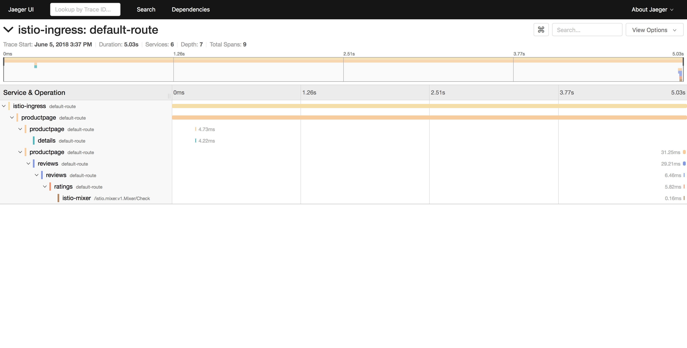

# Lab 6 - Distributed Tracing

The sample Bookinfo application is configured to collect trace spans using Zipkin or Jaeger. Although Istio proxies are able to automatically send spans, it needs help from the application to tie together the entire trace. To do this applications need to propagate the appropriate HTTP headers so that when the proxies send span information to Zipkin or Jaeger, the spans can be correlated correctly into a single trace.

To do this the application collects and propagates the following headers from the incoming request to any outgoing requests:

- `x-request-id`
- `x-b3-traceid`
- `x-b3-spanid`
- `x-b3-parentspanid`
- `x-b3-sampled`
- `x-b3-flags`
- `x-ot-span-context`

### Exposing services

Istio add-on services are deployed by default as `ClusterIP` type services. We can expose the services outside the cluster by either changing the Kubernetes service type to `NodePort` or `LoadBalancer` or by port-forwarding or by configuring Kubernetes Ingress. In this lab, we will briefly demonstrate the `NodePort` and port-forwarding ways of exposing services.

#### Option 1: Expose services with NodePort
To expose them using NodePort service type, we can edit the services and change the service type from `ClusterIP` to `NodePort`

For Jaeger, either of `tracing` or `jaeger-query` can be exposed.
```sh
kubectl -n istio-system edit svc tracing
```

Once this is done the services will be assigned dedicated ports on the hosts. 

To find the assigned ports for Jaeger:
```sh
kubectl -n istio-system get svc tracing
```

#### Option 2: Expose services with port-forwarding

To port-forward Jaeger:
```sh
kubectl -n istio-system port-forward \
  $(kubectl -n istio-system get pod -l app=jaeger -o jsonpath='{.items[0].metadata.name}') \
  16686:16686 &
```
## 6.1 View Traces

If you have not set `INGRESS_HOST` environment variable, please do so by following [Lab 5](../lab-5/README.md).

Now, let us generate a small load on the sample app by using [Meshery].

Let us find the port Jaeger is exposed on by running the following command:
```sh
kubectl -n istio-system get svc tracing
```

You can click on the link at the top of the page which maps to the right port and it will open Jaeger UI in a new tab. 





## [Continue to Lab 7 - Request Routing and Canary Testing](../lab-7/README.md)
